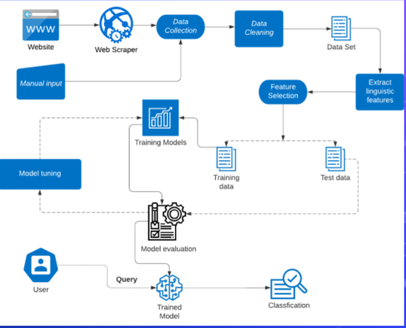
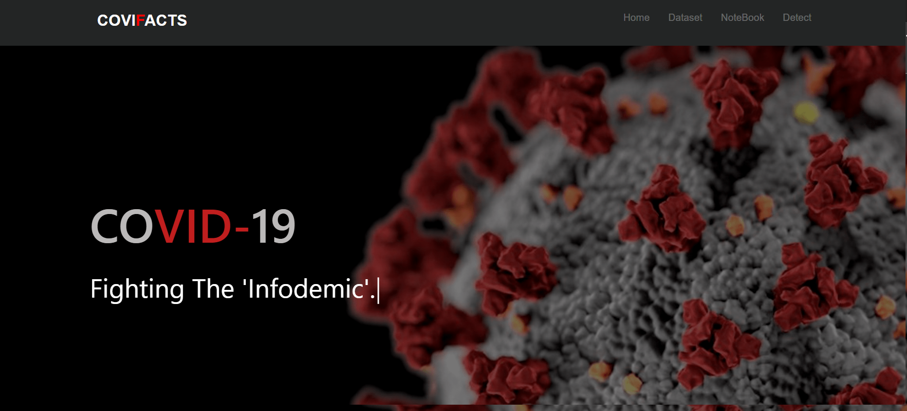
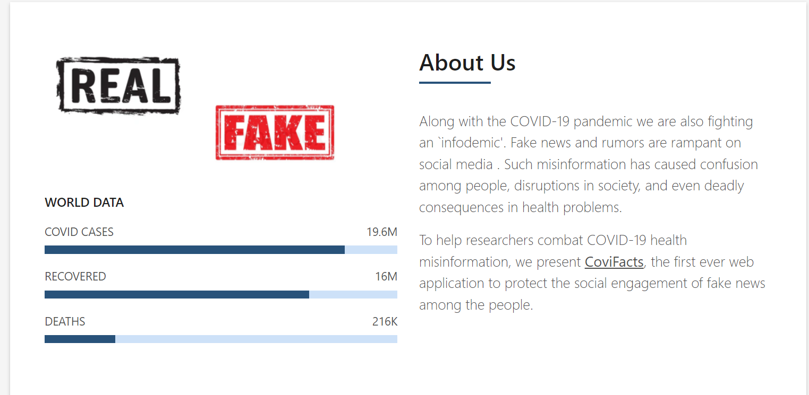
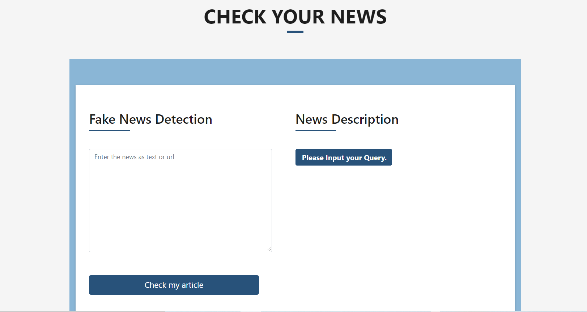
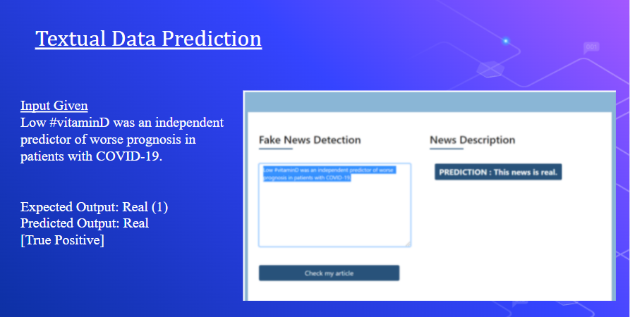
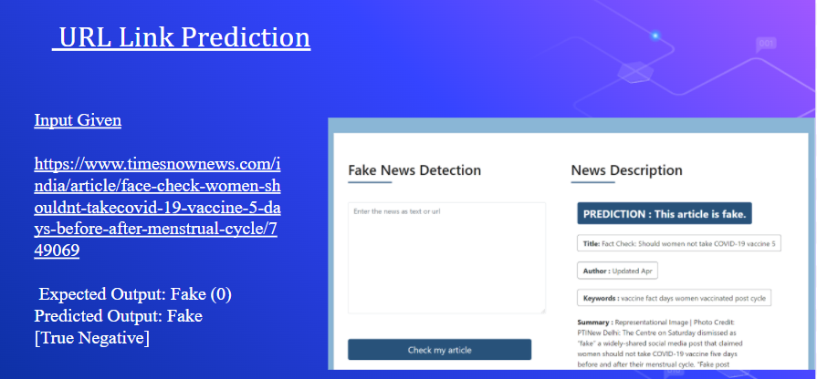
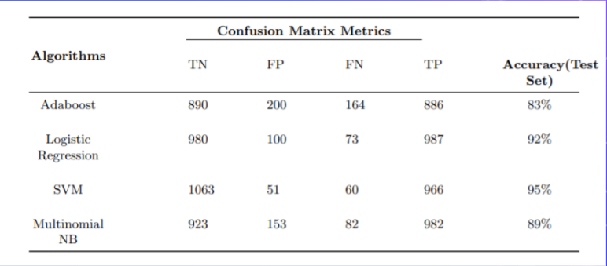

## Covid-19 Fake News Detector 💉 

 Fake news confronts us on a daily basis in today’s fast-paced social media world. While some instances of fake news might seem innocuous, there are many examples that prove to be menacing. Misinformation or Disinformation, take the form of these weaponized lies which
eventually amount to defective information, defamatory allegations, and hoaxes. The only motive behind such a malicious act is to engender emotional instability amongst the public. One such prevalent example today is Covid-19 which has caused an unprecedented paradigm shift in numerous businesses and quotidian activities across the globe. One of the primary activities being, news reporting. On average, people are spending almost one hour a day reading news via many different sources. The development in technology has obviated the barriers between sharing of information, thereby truly making the industry cosmopolitan. Therefore it is paramount to curb fake news at source and prevent it from spreading to a larger audience. This paper describes a system, where the user can identify apocryphal news related to Covid-19 so as to ensure its authenticity
  
### Built With

* [Flask](https://flask.palletsprojects.com/en/2.0.x/)
* [NLTK](https://www.nltk.org/)
* [Python](https://www.python.org/)
* [NLP](https://towardsdatascience.com/introduction-to-natural-language-processing-for-text-df845750fb63)
* [Machine Learning](https://scikit-learn.org/stable/)
 
Research paper Link ( To be published in Springer LNNS Journal )
* [CoviFacts - A Covid-19 Fake News Detector Using NLP](https://ictcs.in/agenda.php)
  
## Block Diagram
  
  
## 1. HomePage
  
   
  
## 2. About Us
  
   
  
## 3. Detection Page
  
   

## 4. Data Prediction
   
  
   

## 4. Comparision of ML Classifiers
   
  
<!-- CONTACT -->
## Contact the developers
Nandita - nandita.kadam@somaiya.edu
Shreyas  - shreyas.mm@somaiya.edu
Krisha - krisha.pamchamia@somaiya.edu

